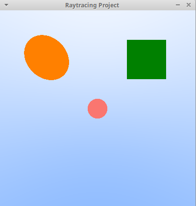
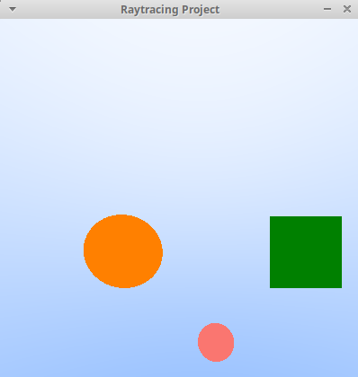
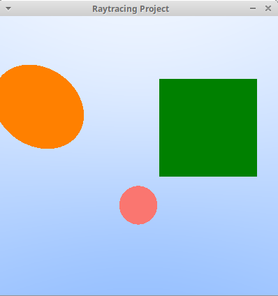
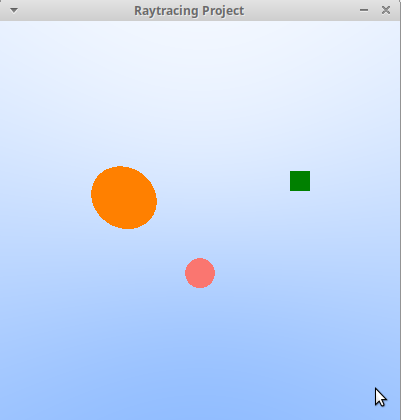

# Project: 2D Ray Tracing #

The following project performed as a part of "Advanced Programming" course offered by Technical University of Munich (TUM) in the winter semester of 2022/2023. 

## Project Members ##
1. Balle Sánchez, Marc
2. Tejero Cervera, Pascual

## Description ##
We defined a 2D screen and created two circles and one square. In order to estimate the distance from the objects to the camera, we first evaluated the intersection of the ray with the corresponding object. If such intersection exists, we computed the distance between the point of intersection and the camera a dot of a certain color is created, otherwise it is the background color.

Addtionallly, the user can adjust the position of the origin of the rays with the arrow keys of the keyboard in such a way that the objects can be moved in four directions. By using the scroll on the mouse, the user can zoom-in or zoom-out the scene. And by pressing enter, the user can close the window and finish the program. 

<table>
  <tr>
    <td>
      
    </td>
    <td>
      
    </td>
  </tr>
  <tr>
    <td>
      
    </td>
    <td>
      
    </td>
  </tr>
</table>

## Run the code ##
In the folder where you cloned the repository, run the following in the terminal:  
`cmake CMakeLists.txt`  
`cd main`  
`make`  
`./project_raytracing` 

## Prerequisites ##
In order to compile and run the code, it is necessary to download the SDL2 and Eigen libraries into the system. One can simply do that by entering in the terminal:  
`sudo apt-get install libsdl2-dev`  
`sudo apt install libeigen3-dev`  

## References ##
[1] Shirley, P., Ray Tracing in one weekend series. Edited by S. Hollasch and T.D. Black. Available at: https://raytracing.github.io/books/RayTracingInOneWeekend.html  
[2] Eigen. Available at: https://eigen.tuxfamily.org/dox/  
[3] SDL2/Frontpage - SDL Wiki. Available at: https://wiki.libsdl.org/SDL2/FrontPage  
 
